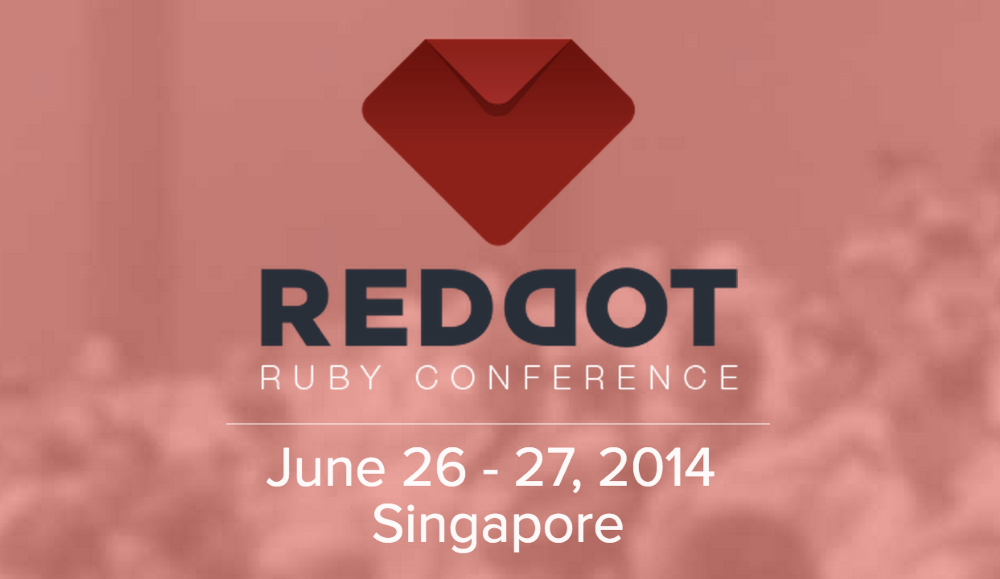
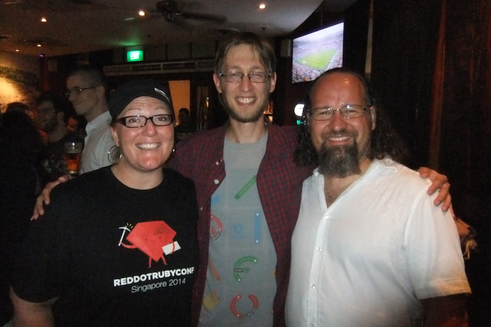
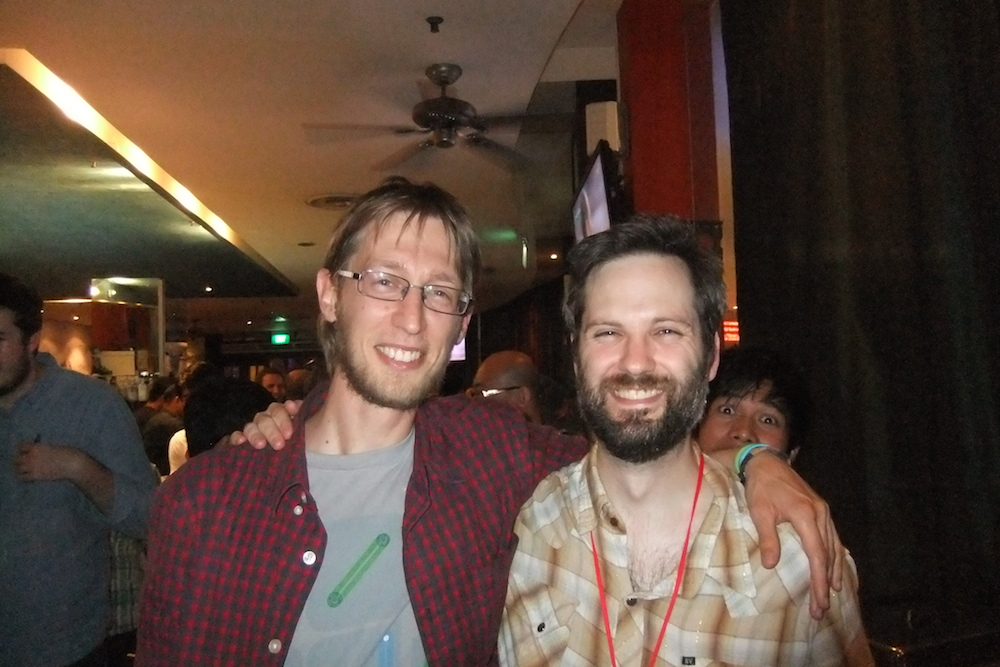

---
#Cкучный доклад про свежаки в руби 2.1 от крутого технаря - соавтора рубей.

##«Ruby.inspect»
#Koichi Sasada

---

#Отличный ликбез по хранению паролей.
##«80,000 Plaintext Passwords: An Open Source Love Story in 3 Acts (Slides)»
#T.J. Schuck
##**#mustwatch** #ликбез

---

#[капитанский доклад про то как вести Open Source-проекты](https://speakerdeck.com/bkeepers/tending-your-open-source-garden)
## «Tending Your Open Source Garden»
#Brandon Keepers, @bkeepers

## #ликбез
---
# Типа WAT-доклад про особенности рубей.

## «The Dark Side of Ruby»
###Gautam Rege

### кто не знает, что такое WAT, просто загуглите

---
#Интро про Elixir с видео-демками

##«Ruby + Elixir: Polyglotting FTW!»
##Benjamin Tan

---
# Доклад-напоминание про Arel
##«ActiveRecord can't do it? Arel can!»
###Prathamesh Sonpatki, Vipul Amler

---

#Короткий доклад про возможности Jekyll
##«5 tips in 5 mins on podcasting with Jekyll»
##Sayanee Basu

## #ликбез
---

# Еще один технарский доклад про Fluentd, очень-очень детально. Это про логгирование, хранение логов, и поиск по ним.

##«Fluentd: Data Streams in Ruby world»
##Satoshi Tagomori

---

#Доклад про ArangoDB! Так и не понял где там DDD :(
##«Domain Driven Design & NoSQL»

##Lucas Dohmen

---
#Очень глубокий и абстрактный доклад про абстракции

##«Magenta is a Lie - and other tales of abstraction»
#Konstantin Haase

## **#mustwatch**

---

# Bryan Helmkamp
## «Shipping Ruby Apps with Docker»
## "Юзайте докер - это будущее. В будущем все будет в докере."

## #ликбез
---
#Piotr Solnica
##«Convenience vs Simplicity»

## Удобство и простота - не одно и тоже.

## **#mustwatch**
---

# Anil Wadghule
## «SOLID Design Principles in Ruby»

## Норм ликбез про принципы SOLID. Смотреть только слайды!

## #ликбез
---

# Рассказ про Rspec 3 - как все раньше было плохо и как теперь стало хорошо.
##«RSpec 3 and why I `expect(you).to care`»

##Jon Rowe
---
# Experience-report про микросервис-архитектуру

## «Adventures with Micro Services in Rails»
##Anand Agrawal

---
# Ликбез про метрики кода и тулзы

##«Safety Nets: Learn to code with confidence»
##Christophe Philemotte

## #ликбез
---

#Aaron Patterson
##«Speed up Rails, Speed up Your Code»

## Вам не нужно быть семи пядей во лбу чтобы контрибутить в рельсу.

## **#mustwatch**

---

#@confreaks

---
#@tenderlove

